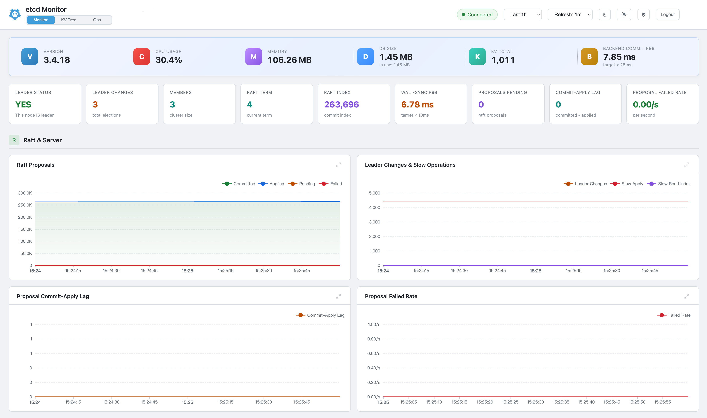

<div align="right">

[English](README.md) | **简体中文**

</div>

<div align="center">

# etcd Monitor

**轻量级、开箱即用的 etcd 集群监控面板**

[](https://go.dev)
[](https://etcd.io)
[](LICENSE)
[](https://github.com)

单文件部署，零依赖，无需 Prometheus，无需 Grafana。



</div>

---

> **安全声明**
>
> 部署到生产前请先阅读 **[SECURITY.md](./SECURITY.md)**，并逐项完成
> **[docs/SECURITY_CHECKLIST.md](./docs/SECURITY_CHECKLIST.md)**。
> 禁止跨机器复用示例 TLS 证书，每台目标机器必须本地运行
> `./tools/gen-certs.sh` 生成证书。

---

## 功能特性

- **零依赖** - 单个静态二进制文件（~31MB），内嵌 Web UI、SQLite 存储，一切自包含
- **多成员集群** - 通过官方 Go SDK 自动发现所有 etcd 成员，并发采集指标
- **多端点故障转移** - 支持逗号分隔的多地址配置，全局健康管理，自动恢复
- **KV 树管理** - 浏览、创建、编辑、删除键值，支持树形/列表视图，兼容 etcd v3 和 v2
- **KV 树搜索** - 实时 key 过滤，保留层级关系，60 秒后台索引刷新
- **运维面板** - 集群运维操作中心：碎片整理、快照备份、告警管理、Leader 迁移、HashKV 一致性校验、Compact 集群压缩、审计日志（支持排序、分页、CSV 导出）
- **80+ 指标，25 个图表** - 覆盖 Raft、磁盘 I/O、MVCC、Lease、网络、gRPC、Go 运行时
- **Dashboard 登录认证** - 本地用户体系（bcrypt）+ 首次登录强制改密 + 失败锁定（详见下方"登录与账号"章节）
- **面板配置** - 面板显示/隐藏、拖拽排序，按用户持久化保存
- **深色 / 浅色主题** - 一键切换，偏好保存在浏览器中
- **HTTPS 支持** - Dashboard 可选启用 TLS，通过 `tools/gen-certs.sh` 在目标机器本地生成自签证书，或使用自有证书
- **etcd TLS/mTLS** - 支持通过客户端证书连接启用了 TLS 的 etcd 集群（CA + 客户端证书 + 私钥）
- **自动降采样** - 智能查询聚合，即使 7 天数据量也能保持面板流畅
- **一键部署** - `install.sh` 自动配置 systemd 服务，`uninstall.sh` 一键清理
- **智能端点检测** - 支持 `127.0.0.1` 配置，自动解析为真实成员 ID
- **数据隔离** - 按成员独立存储于 SQLite，集群端点变更时自动清理历史数据
- **数据保留** - 可配置保留周期（默认 7 天），自动清理过期数据并回收磁盘空间

## 快速开始

### 下载部署

```bash
# 上传到服务器

unzip etcdmonitor-v<VERSION>-linux-amd64.zip
cd etcdmonitor-v<VERSION>-linux-amd64

# （可选）为 Dashboard 本地生成 TLS 证书（启用 HTTPS 时需要）
./tools/gen-certs.sh --host monitor.corp.local --ip <服务器IP>

# 编辑配置
vim config.yaml

# 安装并启动
#   默认: 以 root 运行（与 0.8.x 行为保持一致）
sudo ./install.sh
#   生产推荐: 使用专用非 root 用户
#   sudo useradd -r -s /sbin/nologin -d "$(pwd)" etcdmonitor
#   sudo ./install.sh --run-user etcdmonitor
```

在浏览器中打开 `http://<服务器IP>:9090`（启用 TLS 时为 `https://...`）。

> 上线前请先走一遍 [docs/SECURITY_CHECKLIST.md](./docs/SECURITY_CHECKLIST.md)。

### 从源码构建

```bash
git clone https://github.com/domac/etcdmonitor.git
cd etcdmonitor

# 仅编译二进制文件（用于开发/测试）
./build.sh

# 创建完整部署包（二进制 + 配置 + 证书 + 安装脚本）
./package.sh
# 输出: dist/etcdmonitor-v<version>-linux-amd64.zip
```

**构建要求：** Go 1.21+

## 登录与账号

### 首次登录

首次启动 etcdmonitor 时会自动创建默认管理员账号并在启动日志中打印其密码文件位置：

```
[WARN][Auth] ===============================================================
[WARN][Auth]  Default admin account created.
[WARN][Auth]  Initial password saved to:
[WARN][Auth]    /path/to/data/initial-admin-password
[WARN][Auth]  Please login with username 'admin' and change the password
[WARN][Auth]  immediately. The file will be deleted automatically after a
[WARN][Auth]  successful first password change.
[WARN][Auth] ===============================================================
```

**步骤：**

1. 在服务器上读取初始密码：

   ```bash
   cat /path/to/data/initial-admin-password
   ```

2. 浏览器访问 Dashboard，登录页会提示"首次登录？初始密码在 data/initial-admin-password 文件中"。
3. 使用 `admin` + 初始密码登录。系统会**强制跳转修改密码页**（此时不会下发 session）。
4. 在修改密码页输入：旧密码（即初始密码）+ 新密码（≥ 8 位）+ 再次输入。
5. 修改成功后：
   - `initial-admin-password` 文件自动删除
   - 登录页的"初始密码"提示不再显示
   - 自动跳回登录页，使用新密码登录进入 Dashboard

### 与 etcd 认证的关系

- `config.yaml` 中的 `etcd.username` / `etcd.password` **仅供 Collector / KV Manager / Ops 模块**等 SDK 客户端使用（采集指标、访问 KV、执行运维操作）。
- **Dashboard 登录不再跟随 etcd 是否启用 auth**。即使 etcd 本身未启用 auth，访问 Dashboard 也必须通过本地账号。

### CLI 管理命令

当忘记密码或账号被暴力锁定时，使用以下子命令：

```bash
# 重置指定用户的密码（两次交互式输入；自动置 must_change=1）
./etcdmonitor reset-password --username admin --config config.yaml

# 解锁账号（清零 failed_attempts 和 locked_until，不改密码）
./etcdmonitor unlock --username admin --config config.yaml
```

兜底恢复：若上述 CLI 也不可用，可停服后执行：

```bash
sqlite3 data/etcdmonitor.db "DELETE FROM users;"
```

重启后系统会按首次启动流程重新生成 admin 账号与新的 `initial-admin-password` 文件。

### 安全策略

- 密码使用 **bcrypt** 存储（默认 cost=10，可在 `auth.bcrypt_cost` 配置，有效范围 8-14）
- 连续 5 次密码错误（`login` 与 `change-password` 共享计数）触发账号锁定 15 分钟
- 锁定期间即使正确密码也会被拒绝（避免 timing side-channel 泄露）
- 新密码策略：长度 ≥ 8；不能与旧密码相同
- `data/` 目录权限 `0700`，`data/etcdmonitor.db` 与 `data/initial-admin-password` 权限 `0600`（`install.sh` 自动设置）
- 启动日志、审计日志均不会出现明文密码

### 忘记密码流程图

```
  忘记密码
     │
     ▼
  能 SSH 到服务器？
     │
     ├─ 是 ──▶ etcdmonitor reset-password --username admin
     │                 ↓
     │           交互式输入新密码 × 2
     │                 ↓
     │        新密码生效，must_change=1（下次登录强制再改）
     │
     └─ 否 ──▶ 联系能 SSH 的运维；或停服 DELETE users 表重启
```

## 配置说明

编辑 `config.yaml`：

```yaml
etcd:
  endpoint: "http://127.0.0.1:2379"         # 支持逗号分隔的多地址故障转移
  username: ""                              # 采集器凭据（未启用认证则留空）
  password: ""
  metrics_path: "/metrics"
  tls_enable: false                         # true: 通过 TLS 连接 etcd
  tls_cert: "certs/client.crt"              # 客户端证书（用于 mTLS）
  tls_key: "certs/client.key"               # 客户端私钥（用于 mTLS）
  tls_ca_cert: "certs/ca.crt"              # CA 证书（用于验证 etcd 服务端证书）
  tls_insecure_skip_verify: false           # 跳过服务端证书验证（仅用于测试）
  tls_server_name: ""                       # 服务端名称（SNI 验证）

server:
  listen: ":9090"
  tls_enable: false                         # true: HTTPS, false: HTTP
  tls_cert: "certs/server.crt"
  tls_key: "certs/server.key"
  session_timeout: 3600                     # Dashboard 会话超时（秒）

collector:
  interval: 30          # 秒

storage:
  db_path: "data/etcdmonitor.db"
  retention_days: 7

kv_manager:
  separator: "/"                            # KV 树视图路径分隔符
  connect_timeout: 5                        # etcd 连接超时（秒）
  request_timeout: 30                       # etcd 请求超时（秒）
  max_value_size: 2097152                   # 最大 value 大小（字节），默认 2MB

ops:
  ops_enable: true                          # 启用运维面板（设为 false 隐藏 Ops Tab，/api/ops/* 返回 403）
  audit_retention_days: 7                   # 审计日志保留天数，超期自动清理

auth:
  bcrypt_cost: 10                           # 密码哈希成本（8-14，越界回退到 10 并打印 WARN）
  lockout_threshold: 5                      # 连续登录失败锁定阈值（login 与 change-password 共享）
  lockout_duration_seconds: 900             # 账号锁定时长（秒），默认 15 分钟
  min_password_length: 8                    # 新密码最短长度

log:
  dir: "logs"
  filename: "etcdmonitor.log"
  level: "info"                             # debug, info, warn, error
  max_size_mb: 50                           # 单个日志文件最大大小（MB）
  max_files: 5                              # 保留日志文件个数
  max_age: 30                               # 旧日志保留天数（0 = 不按天数清理）
  compress: false                           # 是否压缩归档旧日志（gzip）
  console: true                             # 是否同时输出到控制台
```

| 参数 | 说明 | 默认值 |
|---|---|---|
| `etcd.endpoint` | etcd 客户端地址（逗号分隔多地址支持故障转移） | `http://127.0.0.1:2379` |
| `etcd.username` | 采集器认证用户名（未启用认证则留空） | - |
| `etcd.password` | 采集器认证密码 | - |
| `etcd.tls_enable` | 启用 TLS 连接 etcd | `false` |
| `etcd.tls_cert` | 客户端证书文件路径（用于 mTLS） | `certs/client.crt` |
| `etcd.tls_key` | 客户端私钥文件路径（用于 mTLS） | `certs/client.key` |
| `etcd.tls_ca_cert` | CA 证书文件路径（用于验证 etcd 服务端证书） | `certs/ca.crt` |
| `etcd.tls_insecure_skip_verify` | 跳过服务端证书验证（仅用于测试） | `false` |
| `etcd.tls_server_name` | 服务端名称（SNI 验证） | - |
| `server.listen` | Dashboard 监听地址 | `:9090` |
| `server.tls_enable` | 启用 HTTPS | `false` |
| `server.tls_cert` | TLS 证书文件路径 | `certs/server.crt` |
| `server.tls_key` | TLS 私钥文件路径 | `certs/server.key` |
| `server.session_timeout` | Dashboard 登录会话超时（秒），0 表示不过期 | `3600` |
| `collector.interval` | 指标采集间隔（秒） | `30` |
| `storage.db_path` | SQLite 数据库文件路径 | `data/etcdmonitor.db` |
| `storage.retention_days` | 数据保留周期（天） | `7` |
| `kv_manager.separator` | KV 树视图的路径分隔符 | `/` |
| `kv_manager.connect_timeout` | KV 操作的 etcd 连接超时（秒） | `5` |
| `kv_manager.request_timeout` | KV 操作的 etcd 请求超时（秒） | `30` |
| `kv_manager.max_value_size` | KV 操作最大 value 大小（字节） | `2097152`（2MB） |
| `ops.ops_enable` | 启用运维面板；设为 `false` 时隐藏 Ops Tab，`/api/ops/*` 返回 403 | `true` |
| `ops.audit_retention_days` | 审计日志保留天数，超期自动清理 | `7` |
| `auth.bcrypt_cost` | 密码 bcrypt 成本（8-14，越界回退到 10） | `10` |
| `auth.lockout_threshold` | 连续登录/改密失败锁定阈值（共享计数） | `5` |
| `auth.lockout_duration_seconds` | 账号锁定时长（秒） | `900` |
| `auth.min_password_length` | 新密码最短长度 | `8` |
| `log.dir` | 日志文件目录 | `logs` |
| `log.filename` | 日志文件名 | `etcdmonitor.log` |
| `log.level` | 日志级别：debug, info, warn, error | `info` |
| `log.max_size_mb` | 单个日志文件最大大小（MB），超过自动切割 | `50` |
| `log.max_files` | 保留日志文件个数 | `5` |
| `log.max_age` | 旧日志保留天数（0 = 不按天数清理，仅按文件数控制） | `30` |
| `log.compress` | 是否压缩归档旧日志（gzip） | `false` |
| `log.console` | 是否同时输出到控制台 | `true` |

## 架构

```
┌──────────────────────────────────────────────────────────────┐
│                   etcdmonitor（单一二进制）                      │
│                                                                │
│  ┌───────────┐   ┌──────────┐   ┌────────────────────────┐   │
│  │  采集器    │──▶│  SQLite  │◀──│  HTTP/S API            │   │
│  │（30s 轮询）│   │（按成员   │   │  /api/current          │   │
│  │  并发采集  │   │  存储）   │   │  /api/range            │   │
│  └─────┬──┬──┘   └──────────┘   │  /api/members          │   │
│        │  │                      │  /api/status            │   │
│  ┌─────┴──┴──┐   ┌──────────┐   │  /api/auth/*           │   │
│  │  健康管理  │   │ 用户偏好 │◀──│  /api/user/*           │   │
│  │（15s 检查）│   │ (JSON)   │   │  /api/kv/v3/*          │   │
│  └─────┬─────┘   └──────────┘   │  /api/kv/v2/*          │   │
│        │                         │  /api/ops/*            │   │
│        │                         └──────────┬─────────────┘   │
│        │                                     │                │
│  ┌─────▼───────┐   ┌──────────┐   ┌────────▼──────────────┐ │
│  │    etcd     │   │KV 管理器 │──▶│  Dashboard             │ │
│  │  /metrics   │   │ v3 + v2  │   │  监控 + KV 树管理       │ │
│  │  x N 节点   │   │按请求连接│   │  运维面板 + 登录        │ │
│  └─────────────┘   └──────────┘   └────────────────────────┘ │
└──────────────────────────────────────────────────────────────┘
```

## 监控面板

### 关键指标横幅

| 指标 | 数据源 | 说明 |
|---|---|---|
| CPU 使用率 | `process_cpu_seconds_total`（速率） | 实时 CPU 使用百分比 |
| 内存 | `process_resident_memory_bytes` | 常驻内存（RSS） |
| 数据库大小 | `etcd_mvcc_db_total_size_in_bytes` | 数据库总大小 / 使用中大小 |
| KV 总数 | `etcd_debugging_mvcc_keys_total` | 键值 revision 总数 |
| Backend Commit P99 | `etcd_disk_backend_commit_duration_seconds` | boltdb 提交延迟 |

### 概览卡片

| 卡片 | 告警条件 |
|---|---|
| Leader 状态 | 无 Leader 时变红 |
| Leader 变更 | 关注频繁变更 |
| 成员数 | 集群规模，悬停查看成员详情 |
| WAL Fsync P99 | > 10ms 时变红 |
| Proposals 待处理 | > 5 时变红 |
| Commit-Apply 延迟 | > 50 时变红 |
| Proposal 失败率 | > 0/s 时变红 |

### 图表面板（25 个图表，18 个默认 + 7 个扩展）

| 分区 | 图表 | 关键指标 |
|---|---|---|
| **Raft & Server** | Proposals、Leader 变更、Commit-Apply 延迟、失败率 | `proposals_*`、`leader_changes`、`slow_apply` |
| **Raft & Server** *（扩展）* | 服务健康 & 配额 | `quota_backend_bytes`、`heartbeat_send_failures`、`health_*`、`client_requests` 按 API 版本 |
| **磁盘性能** | WAL Fsync 耗时、Backend Commit 耗时 | P50/P90/P99 延迟直方图 |
| **磁盘性能** *（扩展）* | 快照 & 碎片整理耗时、Backend Commit 分阶段 | `defrag`/`snapshot`/`snap_db` 延迟，commit 子阶段 `rebalance`/`spill`/`write` P50/P90/P99 |
| **MVCC & 存储** | 数据库大小、MVCC 操作 | `db_total_size`、`put/delete/txn/range` 累计 |
| **MVCC & 存储** *（扩展）* | MVCC Revision & 压缩、Watcher & 事件 | `compact/current_revision`、`compaction_keys/duration`、`events_total`、`pending_events`、`watch_stream`、`slow_watcher` |
| **Lease 管理** *（扩展）* | Lease 活动 | `lease_granted/revoked/renewed/expired` 累计 |
| **网络 & 对等节点** | 对等节点流量、对等节点 RTT | `peer_sent/received_bytes`、RTT P50/P90/P99 |
| **网络 & 对等节点** *（扩展）* | 活跃对等节点 & gRPC 消息 | `network_active_peers`、`grpc_server_msg_sent/received` |
| **gRPC 请求** | 请求速率、客户端流量 | `grpc_server_handled`（OK/Error）、流量字节 |
| **进程 & 运行时** | CPU 使用率、内存、Goroutines、GC 耗时、文件描述符、系统内存 | CPU %、RSS、heap、GC pause、FDs、sys memory |

> 标记为 *（扩展）* 的面板**默认隐藏**。通过 Dashboard 顶部的齿轮按钮（⚙）启用。

## HTTPS / TLS

### Dashboard HTTPS

发布包**不再内置**自签名证书 —— 由运维在目标机器本地生成。项目自带了辅助脚本：

```bash
# 最简形式（SAN 为 localhost / 127.0.0.1 / 0.0.0.0，仅供本机访问）
./tools/gen-certs.sh

# 生产：把用户实际访问 Dashboard 的 hostname / IP 全部写进 SAN。
# --host 与 --ip 都支持多次传入（详见 ./tools/gen-certs.sh --help）。
./tools/gen-certs.sh \
    --host monitor.corp.local \
    --host etcd-dashboard.internal \
    --ip 10.0.1.5 \
    --ip 10.0.1.6 \
    --days 730

# 覆盖已有证书（会让现有会话失效）
./tools/gen-certs.sh --force
```

脚本会在项目目录生成 `certs/server.key`（权限 `0600`）与 `certs/server.crt`（权限 `0644`）。然后在 `config.yaml` 启用 HTTPS：

```yaml
# config.yaml
server:
  tls_enable: true
  tls_cert: "certs/server.crt"
  tls_key:  "certs/server.key"
```

重启服务后通过 `https://<服务器IP>:9090` 访问。

> `install.sh` 在 `tls_enable: true` 但证书文件缺失时会拒绝启动，并明确提示运行 `./tools/gen-certs.sh`。

**使用 CA 签发证书：**

替换 `certs/` 目录下的文件（或使用 symlink 链接到企业证书管理目录 —— `install.sh` 对 symlink 证书保持原权限，不会 `chmod` 链接目标）：

```bash
cp /path/to/your/cert.crt certs/server.crt
cp /path/to/your/cert.key certs/server.key
sudo systemctl restart etcdmonitor
```

> 自签名证书会触发浏览器安全警告。点击"高级" > "继续前往"即可，生产环境建议使用受信任的 CA 证书。

### etcd 客户端 TLS（mTLS）

如果 etcd 集群使用 TLS 部署（`client-transport-security` 配置了 `client-cert-auth: true`），etcd Monitor 支持通过客户端证书连接。

**配置方式：**

```yaml
etcd:
  endpoint: "https://10.0.1.1:2379,https://10.0.1.2:2379,https://10.0.1.3:2379"
  tls_enable: true
  tls_cert: "certs/etcd-client.pem"         # 客户端证书
  tls_key: "certs/etcd-client-key.pem"      # 客户端私钥
  tls_ca_cert: "certs/ca.pem"               # CA 证书
```

**部署步骤：**

```bash
# 将 etcd 客户端证书复制到 etcdmonitor 的 certs 目录
cp /etc/etcd/ssl/etcd-client.pem certs/etcd-client.pem
cp /etc/etcd/ssl/etcd-client-key.pem certs/etcd-client-key.pem
cp /etc/etcd/ssl/ca.pem certs/ca.pem

# 编辑 config.yaml（设置 tls_enable: true 并配置证书路径）
vim config.yaml

# 重启服务
systemctl restart etcdmonitor
```

**支持的场景：**

| 场景 | `tls_enable` | `tls_cert` / `tls_key` | `tls_ca_cert` | `username` / `password` |
|---|---|---|---|---|
| 明文 HTTP（无认证） | `false` | - | - | - |
| 明文 HTTP + 密码认证 | `false` | - | - | ✅ |
| HTTPS + 仅 CA（验证服务端） | `true` | - | ✅ | 可选 |
| HTTPS + mTLS（客户端证书） | `true` | ✅ | ✅ | 可选 |
| HTTPS + mTLS + 密码认证 | `true` | ✅ | ✅ | ✅ |

> **说明：** 当 `tls_enable: true` 时，endpoint 必须使用 `https://`。TLS 配置统一应用于所有 etcd 连接：健康探测、指标采集、成员发现、KV 管理和认证。

## 多成员集群支持

etcd Monitor 通过官方 etcd v3 Go SDK（`clientv3.MemberList()`）自动发现所有集群成员，并发采集指标。

- 无外部二进制依赖（无需 `etcdctl`）
- 成员列表每 60 秒刷新一次（适应扩缩容场景）
- 每个成员的指标以 `member_id` 为键独立存储于 SQLite
- Dashboard 顶部下拉框可切换查看不同成员
- 即使配置为 `127.0.0.1`，也能自动识别本地节点

## 多端点故障转移

配置多个 etcd 端点以实现高可用：

```yaml
etcd:
  endpoint: "http://10.0.1.1:2379,http://10.0.1.2:2379,http://10.0.1.3:2379"
```

- **启动探测** - 启动时并行探测所有端点，不健康的自动排除
- **后台健康检查** - 每 15 秒重新检查所有端点，恢复的端点自动加回
- **全局健康列表** - 采集器、KV 管理器、认证模块共享健康端点列表
- **全部宕机保护** - 所有端点不可达时，进程安全退出并输出明确日志
- 完全向下兼容：单地址配置行为不变

## KV 树管理

内置键值浏览器和编辑器，通过 Dashboard 顶部的 **KV Tree** 标签页访问。

- **双协议支持** - 同时支持 etcd v3（gRPC）和 v2（HTTP）API，一键切换
- **树形视图** - 层级树形展开/折叠，虚线连接线，SVG 文件夹/文件图标
- **列表视图** - 扁平化键列表，显示完整路径
- **根节点** - `/` 根节点始终可见，右键可在顶层创建新键
- **CRUD 操作** - 通过右键菜单和编辑器面板进行创建、读取、更新、删除
- **Key 搜索过滤** - 树面板实时 key 过滤；大小写不敏感子串匹配；匹配目录时展开全部子节点；保留层级结构；切换协议时自动清空搜索状态
- **Keys-only 加载** - 首次加载和 60 秒后台刷新使用 keys-only API（不传输 value），点击节点时按需加载 value
- **ACE 编辑器** - JSON、YAML、TOML、XML 等语法高亮，深色/浅色主题联动
- **TTL 支持** - 可为键设置过期时间，过期键自动检测并从树中移除
- **按请求连接** - 每次 KV 操作创建临时 etcd 连接（etcdkeeper 模式），无长连接
- **协议状态缓存** - v3/v2 切换时保留各自的树状态

## 主题

Dashboard 支持**深色**和**浅色**主题。点击右上角的主题切换按钮（☾ / ☀）切换。偏好保存在浏览器的 localStorage 中。

## 数据保留与存储

### 保留策略

- 超过 `retention_days`（默认 **7 天**）的数据自动清理
- 清理任务**每小时**执行一次
- 删除超过 10,000 行时，执行完整 `VACUUM` 回收磁盘空间
- 较小的删除使用 `incremental_vacuum`，开销最小

### 自动降采样

大时间范围自动降采样，保持面板响应流畅：

| 时间范围 | 聚合粒度 | 每指标数据点数 | 方法 |
|---|---|---|---|
| ≤ 30 分钟 | 无 | ~60 | 原始数据 |
| ≤ 2 小时 | 30 秒 | ~240 | `AVG()` |
| ≤ 12 小时 | 2 分钟 | ~360 | `AVG()` |
| ≤ 48 小时 | 5 分钟 | ~576 | `AVG()` |
| > 48 小时 | 10 分钟 | ~1,008 | `AVG()` |

### 存储估算

| 集群规模 | 7 天数据行数 | 数据库文件大小 |
|---|---|---|
| 1 节点 | ~100 万 | ~50 MB |
| 3 节点 | ~300 万 | ~150 MB |
| 5 节点 | ~500 万 | ~250 MB |

## 服务管理

```bash
# 状态
systemctl status etcdmonitor

# 启动 / 停止 / 重启
systemctl start etcdmonitor
systemctl stop etcdmonitor
systemctl restart etcdmonitor

# 日志
journalctl -u etcdmonitor -f
tail -f logs/etcdmonitor.log
```

服务默认以 `root` 用户运行（与 0.8.x 保持一致，保证升级路径顺畅）。生产部署请改为使用专用非 root 用户 —— 通过 `install.sh` 的 `--run-user <name>` 标志切换：

```bash
sudo useradd -r -s /sbin/nologin -d /opt/etcdmonitor etcdmonitor
sudo ./install.sh --run-user etcdmonitor
```

以 root 运行时 `install.sh` 会打印一次 WARN（终端 + journal），引导运维切换到上述推荐配置。服务通过 `Restart=always` 在崩溃后自动重启。

## 端点变更检测

当 `config.yaml` 中的 `etcd.endpoint` 发生变更（指向不同集群）时，重启后会自动清除所有历史数据以防止数据混淆。在 Dashboard 中切换成员**不会**触发数据清理。

## 卸载

```bash
sudo ./uninstall.sh
```

移除 systemd 服务。可选删除数据和日志（交互式确认）。二进制文件和配置保留以便重新安装。

## API 参考

### Dashboard API

| 端点 | 方法 | 认证 | 说明 |
|---|---|---|---|
| `/api/auth/login` | POST | 否 | 使用本地账号（admin + 密码）登录，返回 `must_change_password` 时前端跳改密页 |
| `/api/auth/change-password` | POST | 否 | 修改密码（零 token 设计，凭 username + old_password 授权） |
| `/api/auth/logout` | POST | 是 | 登出并注销会话 |
| `/api/auth/status` | GET | 否 | 返回 auth_required（恒 true）/ authenticated / initial_setup_pending |
| `/api/members` | GET | 是 | 列出所有集群成员 |
| `/api/current?member_id=<id>` | GET | 是 | 获取指定成员的最新指标快照 |
| `/api/range?member_id=<id>&metrics=m1,m2&range=1h` | GET | 是 | 获取指定指标的时序数据 |
| `/api/status` | GET | 是 | 监控系统状态和集群信息 |
| `/api/user/panel-config` | GET | 是 | 获取用户面板显示与排序配置 |
| `/api/user/panel-config` | PUT | 是 | 保存用户面板显示与排序配置 |
| `/api/debug` | GET | 是 | 调试信息：数据库成员 ID、采集器状态 |

### KV 管理 API（v3）

| 端点 | 方法 | 认证 | 说明 |
|---|---|---|---|
| `/api/kv/v3/connect` | POST | 是 | 连接并获取集群信息（版本、Leader、数据库大小） |
| `/api/kv/v3/separator` | GET | 是 | 获取路径分隔符 |
| `/api/kv/v3/keys` | GET | 是 | 获取全量 key 树结构（仅 key，不含 value） |
| `/api/kv/v3/getpath?key=/` | GET | 是 | 获取指定路径下的键树（递归） |
| `/api/kv/v3/get?key=/foo` | GET | 是 | 获取单个键的值和元数据 |
| `/api/kv/v3/put` | PUT | 是 | 创建或更新键（JSON body: key, value, ttl） |
| `/api/kv/v3/delete` | POST | 是 | 删除键或目录（JSON body: key, dir） |

### KV 管理 API（v2）

| 端点 | 方法 | 认证 | 说明 |
|---|---|---|---|
| `/api/kv/v2/connect` | POST | 是 | 连接并检查 v2 API 可用性 |
| `/api/kv/v2/separator` | GET | 是 | 获取路径分隔符 |
| `/api/kv/v2/keys` | GET | 是 | 获取全量 key 树结构（仅 key，不含 value） |
| `/api/kv/v2/getpath?key=/` | GET | 是 | 获取指定路径下的键树（递归） |
| `/api/kv/v2/get?key=/foo` | GET | 是 | 获取单个键的值和元数据 |
| `/api/kv/v2/put` | PUT | 是 | 创建或更新键（JSON body: key, value, ttl, dir） |
| `/api/kv/v2/delete` | POST | 是 | 删除键或目录（JSON body: key, dir） |

### 运维操作 API

| 端点 | 方法 | 认证 | 说明 |
|---|---|---|---|
| `/api/ops/defragment` | POST | 是 | 对指定成员执行碎片整理（JSON body: member_id） |
| `/api/ops/snapshot` | GET | 是 | 从指定成员下载快照（query: member_id） |
| `/api/ops/alarms` | GET | 是 | 查看集群活跃告警列表 |
| `/api/ops/alarms/disarm` | POST | 是 | 解除指定告警（JSON body: member_id, alarm_type） |
| `/api/ops/move-leader` | POST | 是 | 迁移 Leader 到目标成员（JSON body: target_member_id） |
| `/api/ops/hashkv` | POST | 是 | 跨成员 HashKV 数据一致性校验 |
| `/api/ops/compact` | POST | 是 | 集群级 Revision 压缩（JSON body: retain_count, physical） |
| `/api/ops/compact/revision` | GET | 是 | 获取当前集群 Revision（供面板展示参考） |
| `/api/ops/audit-logs` | GET | 是 | 查询审计日志（query: page, page_size, operation） |

> **认证说明**：受保护端点必须携带有效 session（通过 `Authorization: Bearer <token>` 请求头或 `etcdmonitor_session` Cookie）。Dashboard 访问与 etcd 侧是否启用 auth 完全解耦。

## 环境要求

| 组件 | 要求 |
|---|---|
| 操作系统 | Linux x86_64（CentOS 7/8、RHEL、Ubuntu 等） |
| etcd | 3.4.x（已在 3.4.18 上验证） |
| 运行时 | **无** - 静态链接二进制文件，无需 Go/Node/Python/etcdctl |
| 磁盘 | ~250MB（10MB 二进制 + ~200MB 用于 7 天数据） |

## 贡献

欢迎提交 Pull Request！完整开发指南请看 **[CONTRIBUTING.md](./CONTRIBUTING.md)**
（开发环境、提交规范、vendor 依赖管理、测试要求）。

**快速开始：**

1. Fork 本仓库
2. 创建功能分支（`git checkout -b feature/amazing-feature`）
3. 安装预提交钩子（运行 `gofmt`、`go vet`、`gitleaks`）：
   ```bash
   ln -sf ../../tools/pre-commit.sh .git/hooks/pre-commit
   chmod +x .git/hooks/pre-commit
   ```
4. 提交更改并在 `CHANGELOG.md` 的 `[Unreleased]` 段加条目
5. 推送到分支（`git push origin feature/amazing-feature`）
6. 使用项目 PR 模板创建 Pull Request

**安全问题** 请按 **[SECURITY.md](./SECURITY.md)** 私下报告，不要在公开 Issue 中提交。

## 从 0.8.x 升级

本次发布包含 **破坏性的部署变更**（发布包不再内置 TLS 证书，必须由运维在目标机器本地生成）。服务默认仍以 `root` 运行，以保证升级路径顺畅；生产部署强烈建议改为非 root 专用用户。每台目标机器上执行：

```bash
# 1. 本地重新生成 TLS 证书（旧示例证书已吊销）
cd /opt/etcdmonitor
./tools/gen-certs.sh --host monitor.corp.local --ip 10.0.1.5 --days 730

# 2. 重装（写入加固过的 systemd unit）
#    默认行为保持 root，与 0.8.x 一致：
sudo ./install.sh

# 2'. 生产推荐：切换到专用非 root 用户
sudo useradd -r -s /sbin/nologin -d /opt/etcdmonitor etcdmonitor
sudo ./install.sh --run-user etcdmonitor

# 3. 验证沙箱
systemd-analyze security etcdmonitor
```

以 root 运行时 `install.sh` 会在终端与 `journalctl -u etcdmonitor` 各打印一次 WARN，引导运维切换到 `--run-user` 推荐配置。

## 许可证

本项目基于 MIT 许可证开源 - 详见 [LICENSE](LICENSE) 文件。
